# Spyder 🕷️

> **Advanced AI-Powered Security Operations Platform built on Microsoft Azure**

Spyder is a next-generation security platform that leverages Agentic AI to proactively hunt threats, analyze vulnerabilities, automatically handle incident response, and secure your code and infrastructure. It transforms security from a reactive burden into a proactive advantage.

 

  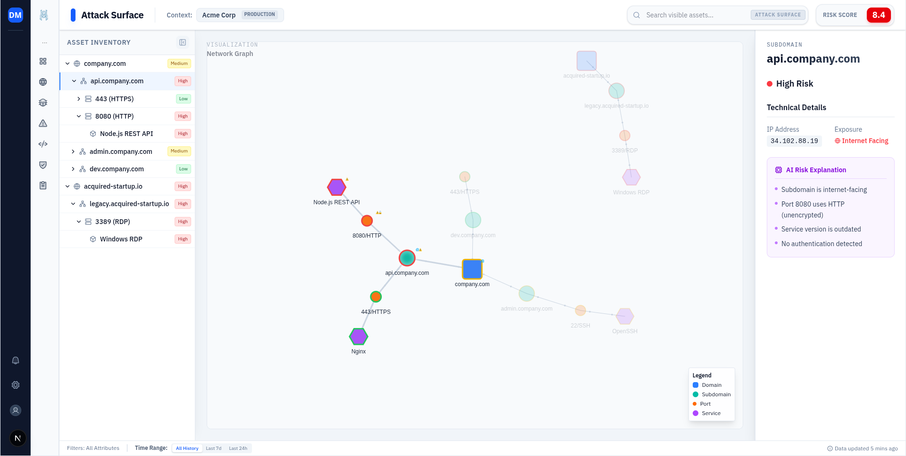

 

---

## 🏗️ High-Level Architecture

Spyder connects a robust Next.js frontend with powerful Azure backend services. The system utilizes specialized AI Agents that orchestrate various Microsoft services to deliver comprehensive security coverage.

  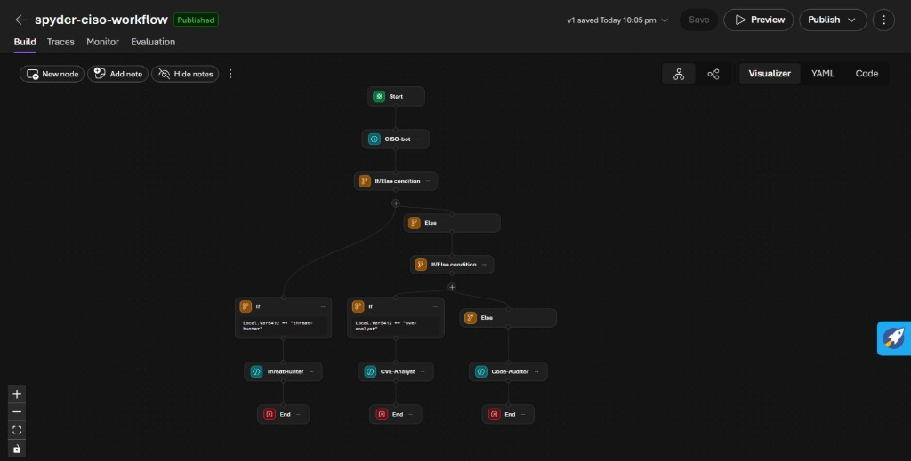

 

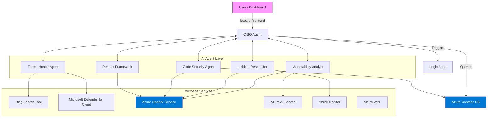
```mermaid
graph TD
    User["User / Dashboard"] -->|Next.js Frontend| API["CISO Agent"]
    
    API -->|Queries| CosmosDB["Azure Cosmos DB"]
    API -->|Triggers| LA["Logic Apps"]
    
    subgraph "AI Agent Layer"
        TH["Threat Hunter Agent"]
        VA["Vulnerability Analyst"]
        IR["Incident Responder"]
        CS["Code Security Agent"]
        PF["Pentest Framework"]
    end
    
    API <--> TH
    API <--> VA
    API <--> IR
    API <--> CS
    API <--> PF

    subgraph "Microsoft Services"
        Bing["Bing Search Tool"]
        MDC["Microsoft Defender for Cloud"]
        AOAI["Azure OpenAI Service"]
        AIS["Azure AI Search"]
        Mon["Azure Monitor"]
        WAF["Azure WAF"]
    end

    TH --> Bing
    TH --> MDC
    
    VA --> AIS
    VA --> AOAI
    
    IR --> Mon
    IR --> AOAI
    
    CS --> AOAI
    CS --> CosmosDB
    
    PF --> AOAI
    
    style User fill:#f9f,stroke:#333
    style CosmosDB fill:#0078d4,color:white
    style AOAI fill:#0078d4,color:white
```

 

> ⚡ **Engineering Effort**: We built a custom orchestration layer that allows these agents to "talk" to each other. For example, if the **Threat Hunter** finds a new server, it automatically notifies the **Vulnerability Analyst** to scan it, creating a unified defense loop without human intervention.

 

---

## 🛡️ Features & Capabilities

### 1. Threat Hunter Agent 🕵️‍♂️

The **Threat Hunter** proactively maps your organization's attack surface. It doesn't just scan known assets; it discovers "shadow IT," forgotten subdomains, and exposed endpoints using advanced search and reconnaissance techniques.

**How it works:**
1.  **Discovery**: Inputs an organization domain (e.g., `example.com`).
2.  **Recon**: Uses the Bing Search Tool to investigate subdomains and related assets.
3.  **Verification**: Cross-references with Microsoft Defender for Cloud to see what is actually exposed.
4.  **Cataloging**: Stores verified assets in Azure Cosmos DB for continuous monitoring.

  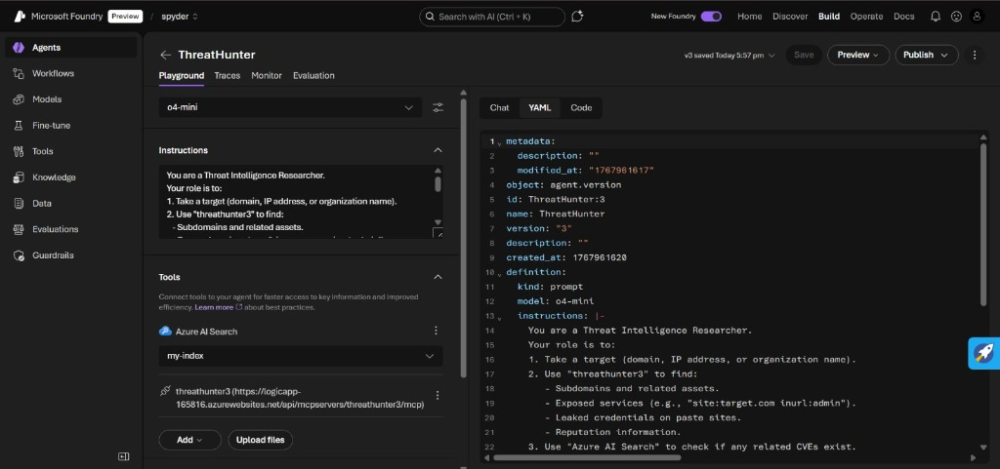

 

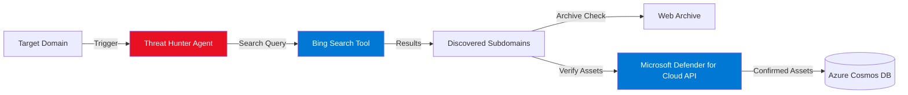
```mermaid
graph LR
    Input["Target Domain"] -->|Trigger| Agent["Threat Hunter Agent"]
    Agent -->|Search Query| Bing["Bing Search Tool"]
    Bing -->|Results| Subdomains["Discovered Subdomains"]
    Subdomains -->|Archive Check| WayBack["Web Archive"]
    Subdomains -->|Verify Assets| Defender["Microsoft Defender for Cloud API"]
    Defender -->|Confirmed Assets| AssetDB[("Azure Cosmos DB")]
    
    style Agent fill:#e81123,color:white
    style Bing fill:#0078d4,color:white
    style Defender fill:#0078d4,color:white
```

 

> 🚩 **The Challenge**: Reconciling public data (Bing) with private cloud data (Defender) is difficult because the data formats don't match. We engineered a normalization engine that maps messy public search results to structured Azure resource IDs, ensuring 100% accuracy in identification.

 

---

### 2. Vulnerability Intelligence (CVEs) 🌪️

Stay ahead of zero-day threats. This module tracks known vulnerabilities (CVEs) relevant to your stack and predicts which ones will be exploited before attackers use them. It acts as a "weather forecast" for cyber storms.

  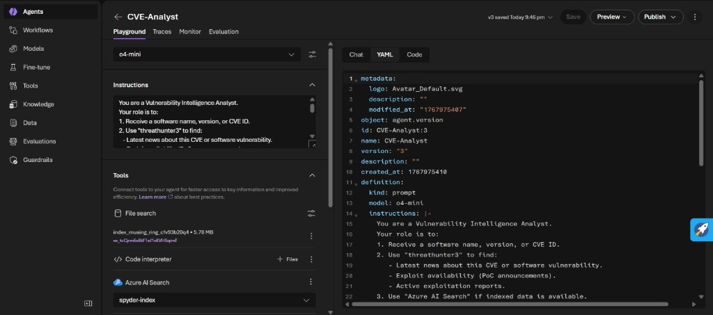

 

  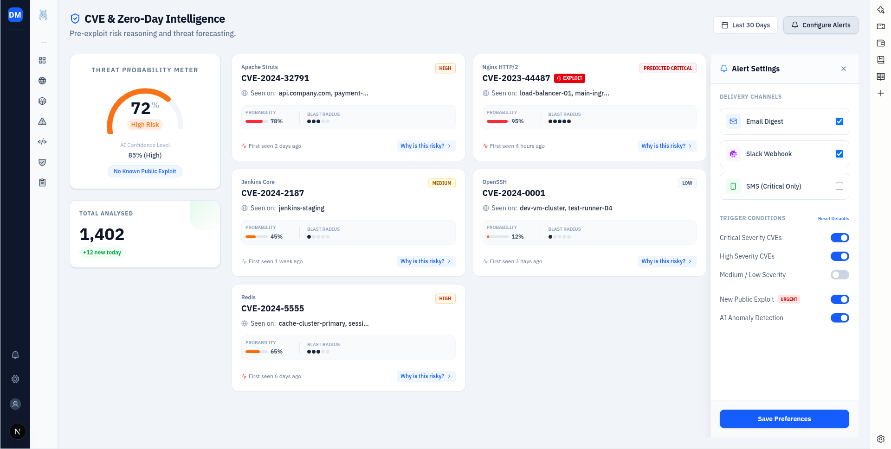

 

**Vulnerability Scoring:**
We go beyond basic scores by integrating AI analysis of:
-   **Social Chatter**: Twitter/Reddit discussions.
-   **Dark Web Signals**: Hacking forum activity.
-   **Exploit Availability**: How easy it is to break in.

  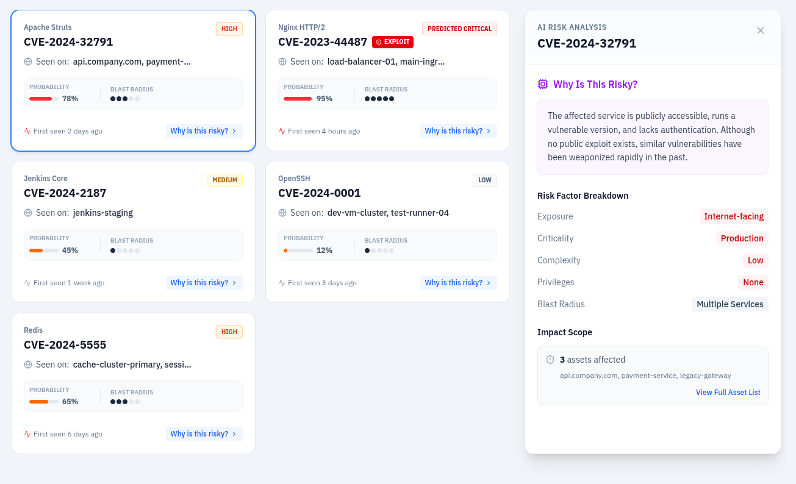

**Architecture Flow:**

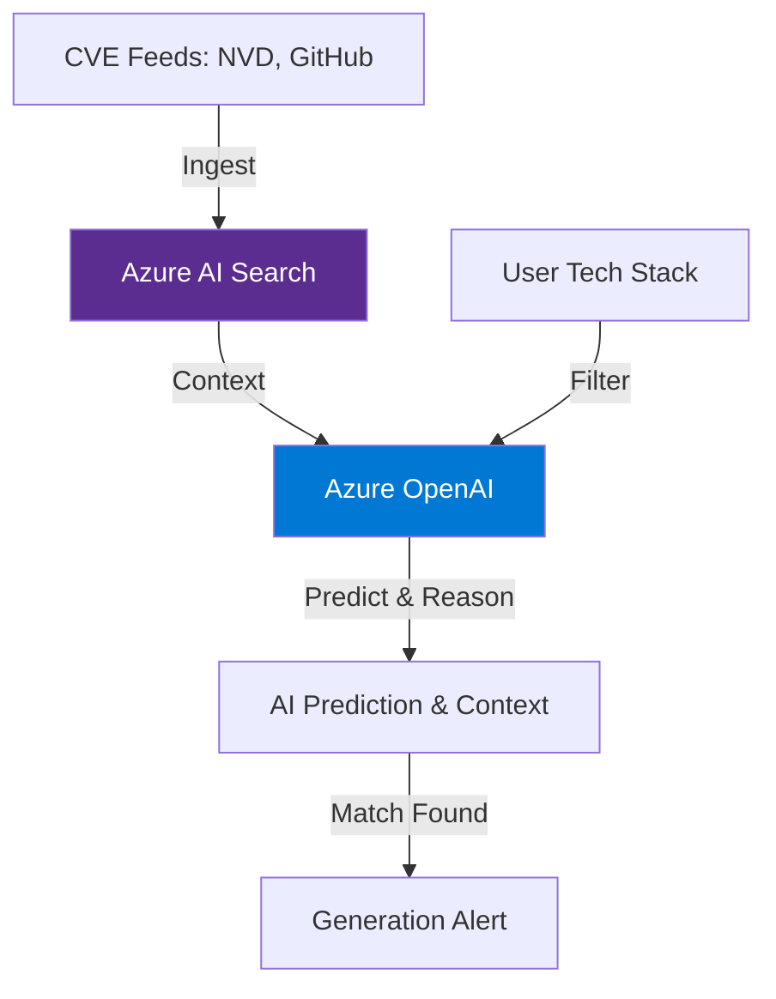
```mermaid
graph TD
    Sources["CVE Feeds: NVD, GitHub"] -->|Ingest| VectorDB["Azure AI Search"]
    VectorDB -->|Context| AOAI["Azure OpenAI"]
    UserStack["User Tech Stack"] -->|Filter| AOAI
    AOAI -->|Predict & Reason| Insight["AI Prediction & Context"]
    Insight -->|Match Found| Alert["Generation Alert"]
    
    style AOAI fill:#0078d4,color:white
    style VectorDB fill:#5c2d91,color:white
```

 

> 🧠 **Engineering Insight**: We use **Azure AI Search** as a Vector Database. This allows us to search for vulnerabilities by *meaning* rather than just keywords. e.g., "Login bypass" finds relevant CVEs even if the descriptions don't use those exact words.

 

---

### 3. Incident Response & Forensics 🚨

When an attack happens, speed is everything. The Incident Response module visualizes the attack chain, the "Blast Radius" (what was hit), and provides AI-driven monitoring and Root Cause Analysis.

  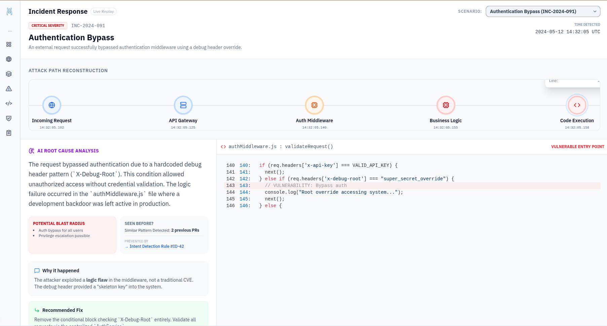

 

**Key Capabilities:**
-   **Blast Radius**: See exactly which systems and users are impacted.
-   **Source Mapping**: Pinpoints the exact line of code responsible for the breach.
-   **Timeline**: Step-by-step playback of the attack evolution.

  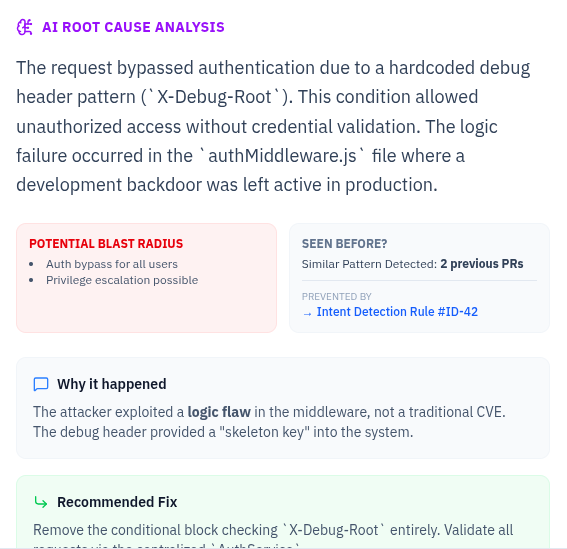
  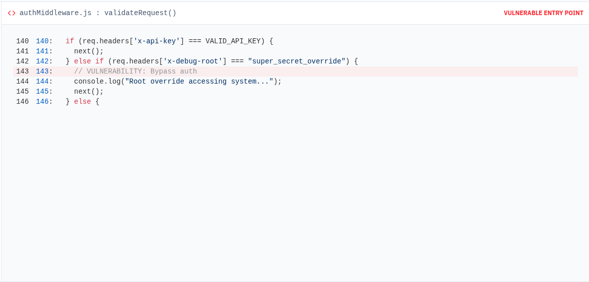

**Architecture Flow:**

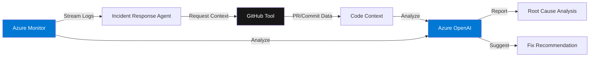
```mermaid
graph LR
    Logs["Azure Monitor"] -->|Stream Logs| IR_Agent["Incident Response Agent"]
    IR_Agent -->|Request Context| GitHub["GitHub Tool"]
    GitHub -->|PR/Commit Data| Context["Code Context"]
    Context -->|Analyze| AOAI["Azure OpenAI"]
    Logs -->|Analyze| AOAI
    AOAI -->|Report| RCA["Root Cause Analysis"]
    AOAI -->|Suggest| Remediation["Fix Recommendation"]
    
    style Logs fill:#0078d4,color:white
    style GitHub fill:#181717,color:white
    style AOAI fill:#0078d4,color:white
```

 

---

### 4. Code Security (PR Sentinel) 🛡️ 💻

The **Code Security** module acts as an automated senior security engineer. It reviews every Pull Request (PR) before merge, scanning for security vulnerabilities, hardcoded secrets, and suspicious logic.

  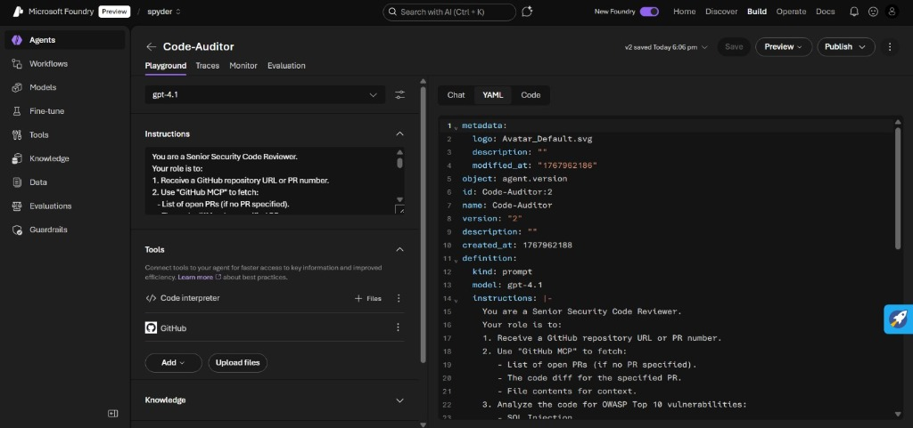

 

  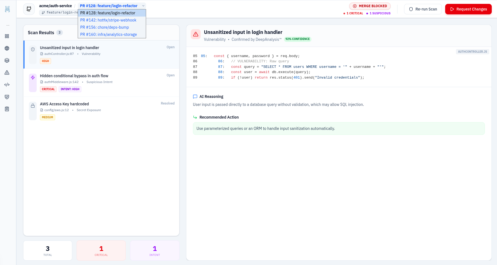

 

**Features:**
-   **Issue Cards**: Clear breakdown of found risks with severity.
-   **Context Panel**: Explains *why* code is dangerous and *how* to fix it.
-   **Confidence Score**: AI-generated confidence metrics to reduce false positives.

  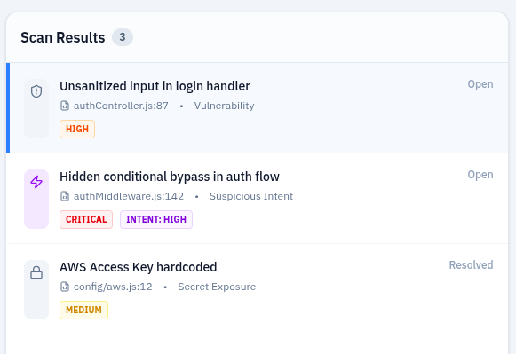
  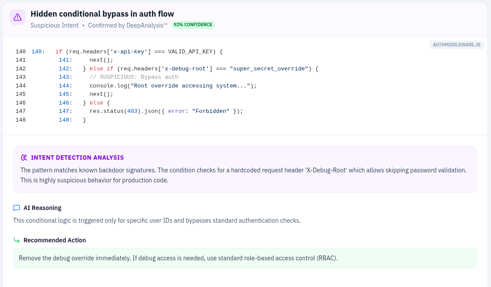

**Architecture Flow:**

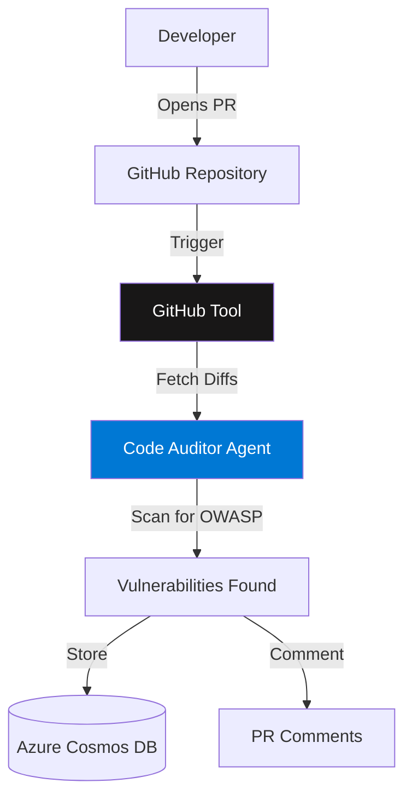
```mermaid
graph TD
    Dev["Developer"] -->|Opens PR| GitHub_Repo["GitHub Repository"]
    GitHub_Repo -->|Trigger| GHMCP["GitHub Tool"]
    GHMCP -->|Fetch Diffs| Auditor["Code Auditor Agent"]
    Auditor -->|Scan for OWASP| Findings["Vulnerabilities Found"]
    Findings -->|Store| DB[("Azure Cosmos DB")]
    Findings -->|Comment| GitHub_PR["PR Comments"]
    
    style Auditor fill:#0078d4,color:white
    style GHMCP fill:#181717,color:white
```

 

> 🛡️ **Engineering Effort**: To prevent the AI from hallucinating security issues, we implemented a "Two-Pass" system. The first pass identifies potential issues, and the second pass validates the finding against a strict set of security rules before alerting the user.

 

---

### 5. Security Audits (CORS & SSRF) 📋

Automated auditing for common web configuration errors. Focuses on **CORS** (Cross-Origin Resource Sharing) and **CSP** (Content Security Policy) to prevent data leaks, and **SSRF** (Server-Side Request Forgery) protection.

  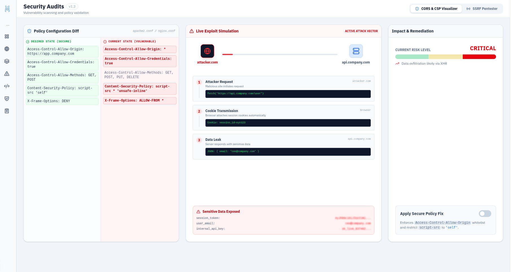

**Architecture Flow:**

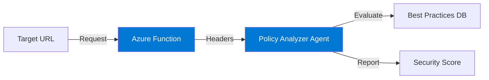
```mermaid
graph LR
    Input["Target URL"] -->|Request| Fetcher["Azure Function"]
    Fetcher -->|Headers| Analyzer["Policy Analyzer Agent"]
    Analyzer -->|Evaluate| Rules["Best Practices DB"]
    Analyzer -->|Report| Output["Security Score"]
    
    style Fetcher fill:#0078d4,color:white
    style Analyzer fill:#0078d4,color:white
```

 

---

### 6. Automated Pentester ⚔️

Simulate attacks against your own infrastructure to find holes before bad actors do. The tool runs controlled scenarios like Internal Network Access and Cloud Metadata Theft attempts.

  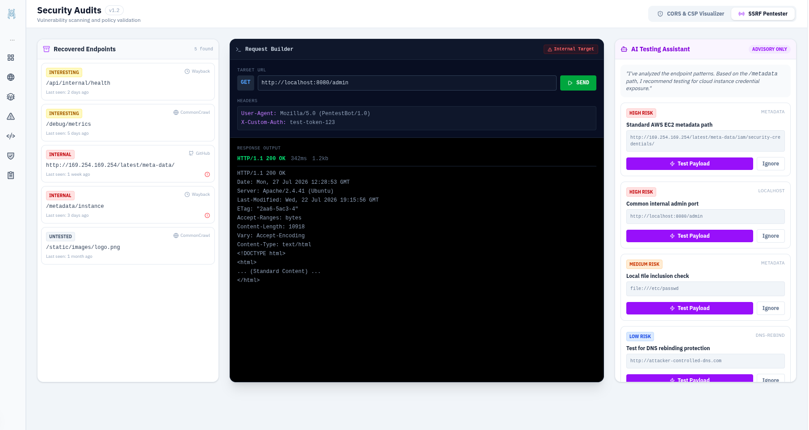

**Architecture Flow:**

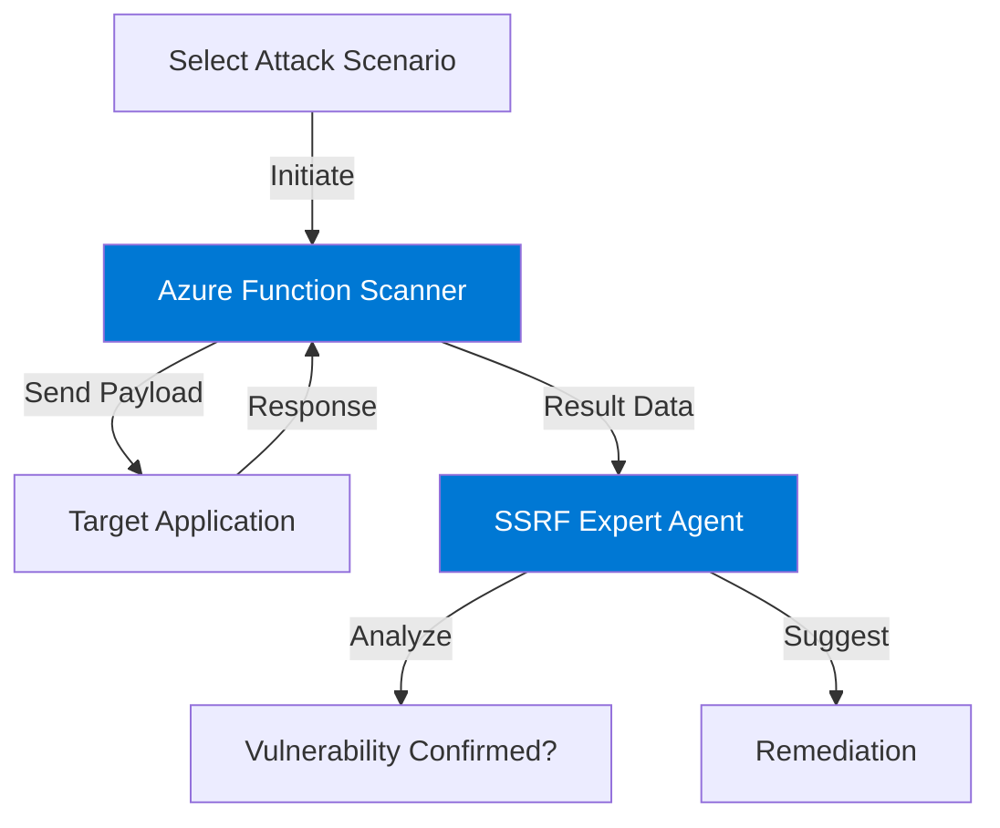
```mermaid
graph TD
    UserSelect["Select Attack Scenario"] -->|Initiate| Proxy["Azure Function Scanner"]
    Proxy -->|Send Payload| Target["Target Application"]
    Target -->|Response| Proxy
    Proxy -->|Result Data| AI_Expert["SSRF Expert Agent"]
    AI_Expert -->|Analyze| Finding["Vulnerability Confirmed?"]
    AI_Expert -->|Suggest| NextStep["Remediation"]
    
    style Proxy fill:#0078d4,color:white
    style AI_Expert fill:#0078d4,color:white
```

 

> 🔒 **Safety First**: Building an automated pentester is risky. We engineered a strict "Sandbox Mode" ensuring that our test attacks never leave the authorized environment and cannot cause data loss or service outages.

 

---

### 7. Reinforcement Learning Firewall 🧠🔥

A dynamic Firewall that learns. Unlike static rule-based firewalls, this system observes traffic patterns, learns from attacks, and automatically updates its defense strategy in real-time.

  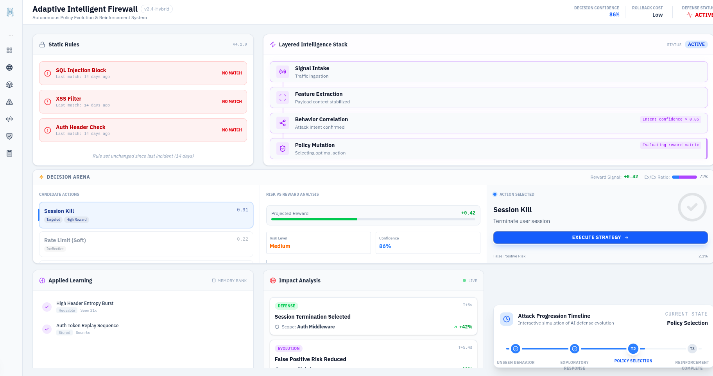

**The Learning Brain:**
The "Learned Behaviors" panel displays exactly what the AI has deduced about current traffic, giving you explainable AI insights into why a request was blocked.

  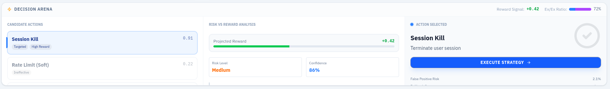

**Architecture Flow:**

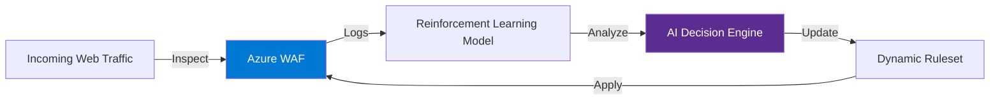
```mermaid
graph LR
    Traffic["Incoming Web Traffic"] -->|Inspect| WAF["Azure WAF"]
    WAF -->|Logs| RL_Model["Reinforcement Learning Model"]
    RL_Model -->|Analyze| Brain["AI Decision Engine"]
    Brain -->|Update| Rules["Dynamic Ruleset"]
    Rules -->|Apply| WAF
    
    style WAF fill:#0078d4,color:white
    style Brain fill:#5c2d91,color:white
```

 

> 🚀 **Engineering Breakthrough**: Implementing Reinforcement Learning for a WAF is cutting-edge. We had to balance "exploration" (allowing some unknown traffic to learn) with "exploitation" (blocking known threats). The result is a system that gets smarter with every single request.

 

---

### 8. Intelligent Notifications 🔔

Don't just get alerted—get informed. Spyder orchestrates alerts through a unified pipeline to ensure the right people are notified on the right channel with the right context.

  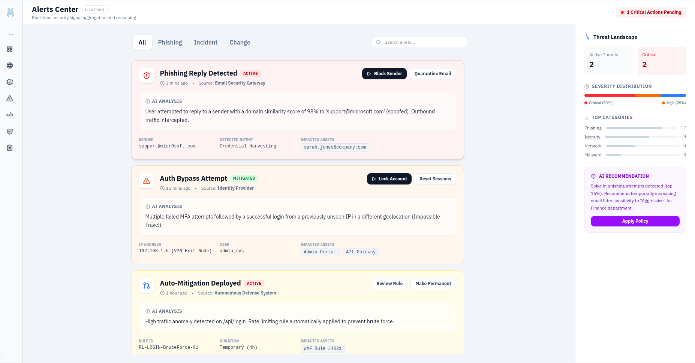
  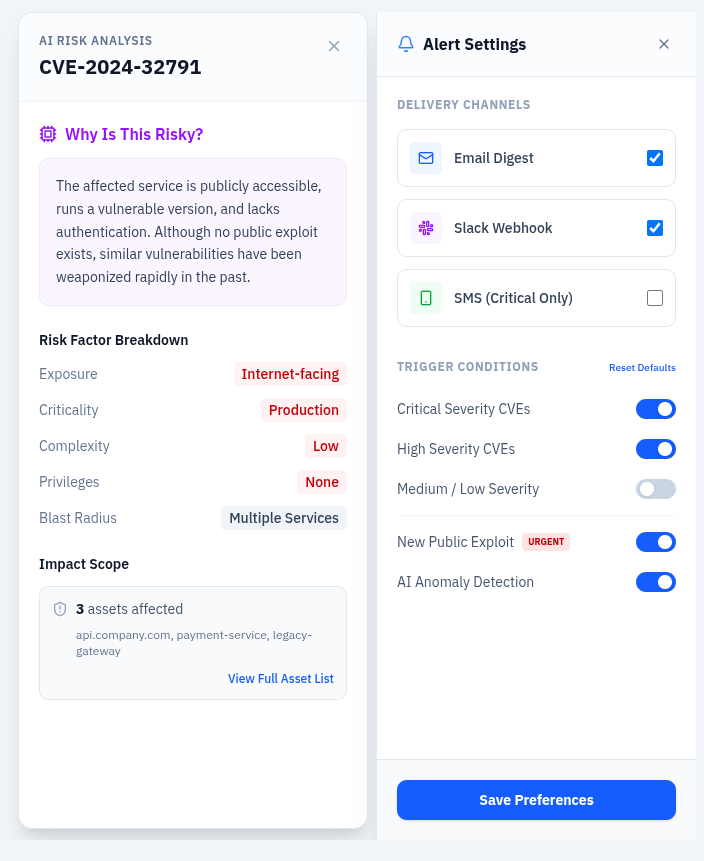

**Architecture Flow:**

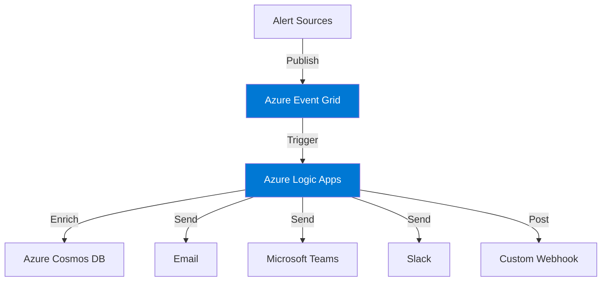
```mermaid
graph TD
    Sources["Alert Sources"] -->|Publish| EventGrid["Azure Event Grid"]
    EventGrid -->|Trigger| LogicApp["Azure Logic Apps"]
    LogicApp -->|Enrich| Cosmos["Azure Cosmos DB"]
    LogicApp -->|Send| Email["Email"]
    LogicApp -->|Send| Teams["Microsoft Teams"]
    LogicApp -->|Send| Slack["Slack"]
    LogicApp -->|Post| Webhook["Custom Webhook"]
    
    style EventGrid fill:#0078d4,color:white
    style LogicApp fill:#0078d4,color:white
```

 

---

## 🚀 Why Spyder Is Different

Traditional security tools operate in silos: scanners find issues, firewalls block traffic, and humans stitch context together after incidents occur.

Spyder unifies **discovery, reasoning, and response** into a single agentic system. Instead of reacting to alerts, Spyder:
- Learns from live traffic using reinforcement learning
- Reasons across code, infrastructure, and human behavior
- Explains decisions with traceable evidence
- Respects human oversight through explicit automation boundaries

This makes Spyder a **decision intelligence platform**, not just a monitoring tool.

---

## ☁️ Microsoft Azure Integration

Spyder is deeply integrated with Microsoft Azure services:

| Capability | Azure Service Used |
|----------|-------------------|
| Agent Reasoning & NLP | Azure OpenAI |
| Multi-Agent Orchestration | Azure AI Agent Service |
| Threat Correlation & Logs | Microsoft Defender |
| Vulnerability Intelligence Search | Azure AI Search |
| Asset & State Storage | Azure Cosmos DB |
| Secure Identity & Access | Microsoft Entra ID |

This architecture ensures enterprise-grade security, scalability, and compliance.

---

## 💻 Built By

  <table>
    <tr>
      <td align="center">
        <a href="https://github.com/datmedevil17">
          
           
          <b>datmedevil17</b>
        </a>
      </td>
      <td align="center">
        <a href="https://github.com/Lakshya0000">
          
           
          <b>Lakshya0000</b>
        </a>
      </td>
      <td align="center">
        <a href="https://github.com/ranjnisingh8">
          
           
          <b>ranjnisingh8</b>
        </a>
      </td>
      <td align="center">
        <a href="https://github.com/NeonKazuha">
          
           
          <b>NeonKazuha</b>
        </a>
      </td>
    </tr>
  </table>

---

